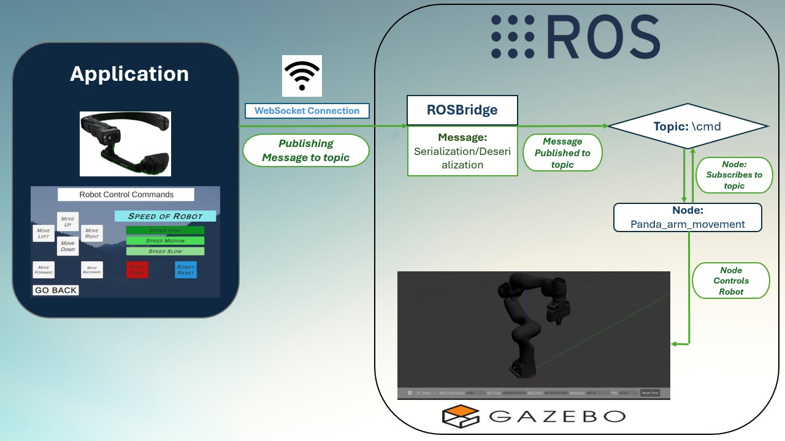

# Robotic Arm Application

This project integrates Augmented Reality (AR) with robot programming using a voice-controlled interface. The application enables hands-free control of a robotic arm through voice commands, enhancing accessibility and safety in industrial automation.

- **Technologies Used**: ROS, Unity, Gazebo, RealWear Headset
- **Key Features**: Voice command control, simulation in Gazebo, and AR visualization through RealWear.

---

## Key Features
- **Voice-Controlled Commands**: Control the robotic arm via spoken instructions using RealWear headset.
- **AR Integration**: Provides a user-friendly visual interface for enhanced interaction.
- **Robot Simulation**: Uses Gazebo to simulate robotic actions.

---

---

## Implementation Details

This project demonstrates the integration of Augmented Reality (AR) with robotics for a voice-controlled robotic arm using the RealWear headset. Below are the key implementation steps:

---

### 1. System Architecture

The system connects several components to enable seamless operation:
- **RealWear Headset**: Captures voice commands for hands-free interaction.
- **ROS (Robot Operating System)**: Manages communication between components and the robotic arm.
- **Unity Engine**: Provides an AR-based user interface.
- **Gazebo Simulation**: Simulates robotic arm actions for testing and evaluation.

This setup creates a robust framework to convert voice commands into precise robotic actions while leveraging AR for user feedback.

---

### 2. Voice Command Recognition

The RealWear Navigator 520 headset processes natural language commands, which are then sent to ROS. Key steps include:
1. **Voice Input**: Commands are recognized using RealWear’s built-in APIs.
2. **Command Translation**: Spoken inputs are mapped to predefined robotic actions.
3. **ROS Communication**: Translates and publishes commands to the robot controller via ROS topics.

---

### 3. User Interface in Unity

An intuitive AR-based UI was designed to enhance the user experience:
- **Command Menu**: Dynamically displays available voice commands.
- **AR Overlays**: Provide real-time feedback on the robot's status and actions.

---

### 4. ROS Integration

ROS acts as the middleware to manage communication and motion control:
- **ROS Nodes**: Handle command processing and robotic motion execution.
- **Motion Planning**: Leverages MoveIt! for trajectory generation, ensuring precise and safe robotic movements.
- **Real-Time Data Exchange**: Commands flow between Unity, ROS, and Gazebo using WebSocket communication via ROSBridge.

---

### 5. Gazebo Simulation

Gazebo simulates the Franka Emika robotic arm to ensure safe and reliable performance before real-world deployment:
- **Model Setup**: Configured the robot and environment for accurate simulations.
- **Testing Metrics**: Evaluated the system's accuracy, response time, and precision in a controlled setting.

---

### 6. Testing and Evaluation

Performance was rigorously tested based on these metrics:
- **Command Accuracy**: Achieved 95% accuracy for correctly recognized and executed commands.
- **Response Latency**: Measured an average response time of 0.8 seconds.
- **Precision**: Ensured the robotic arm achieved ±0.5 mm accuracy in target positioning.

---

### 7. Challenges and Solutions

- **Latency**: Optimized data flow between Unity and ROS to minimize delays.
- **Command Recognition**: Improved parsing logic for higher accuracy in noisy environments.
- **AR Feedback**: Enhanced Unity's rendering pipeline for real-time AR updates.

---

## Future Enhancements
- **Real-World Testing**: Move from Gazebo simulation to real robotic arm testing.
- **Expanded Command Set**: Integrate additional voice commands for complex tasks.

This project highlights an innovative approach to combining AR and robotics, providing a scalable solution for hands-free and intuitive robotic control in industrial and operational environments.

---

## Contact
I'm passionate about robotics and AR technologies. Feel free to reach out for discussions or collaborations.

- **Email**: pranjalsamant@outlook.com
- **LinkedIn**: [linkedin.com/in/pranjalsamant](https://www.linkedin.com/in/pranjalsamant)

Thank you for visiting this project! Explore the repository for more details.
