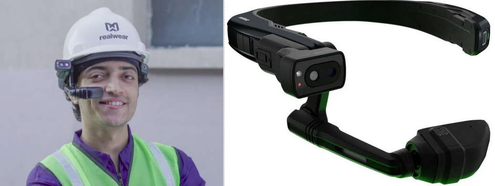
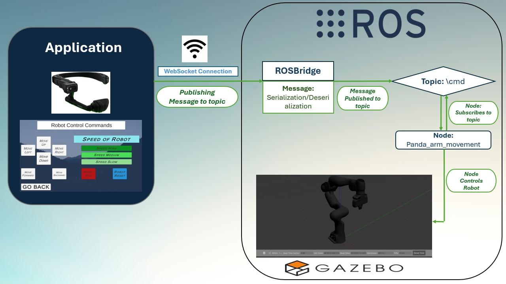
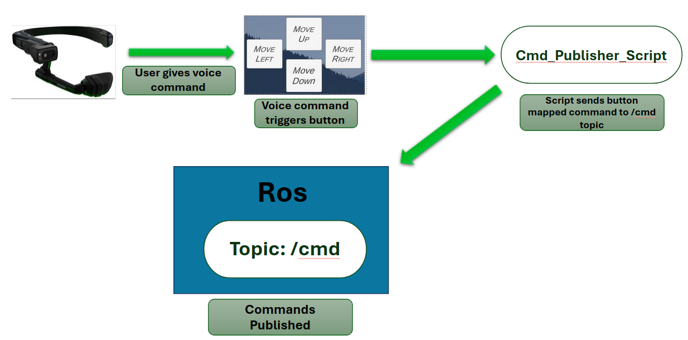
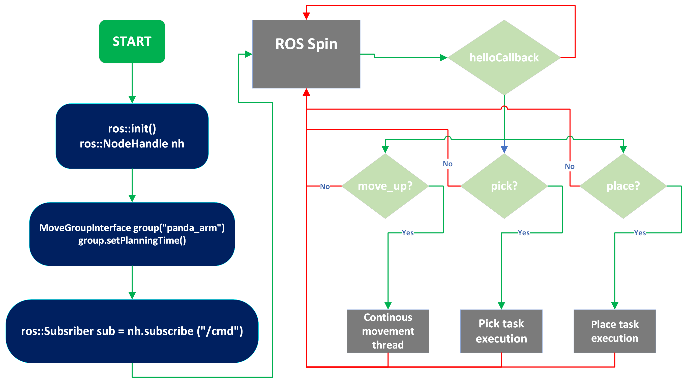
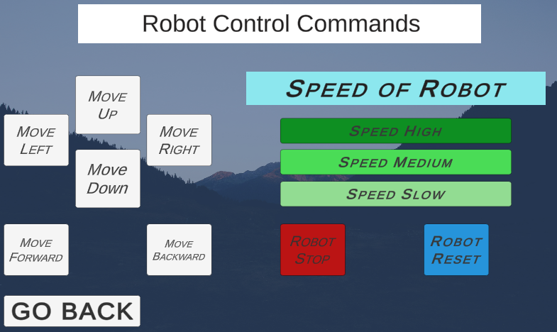
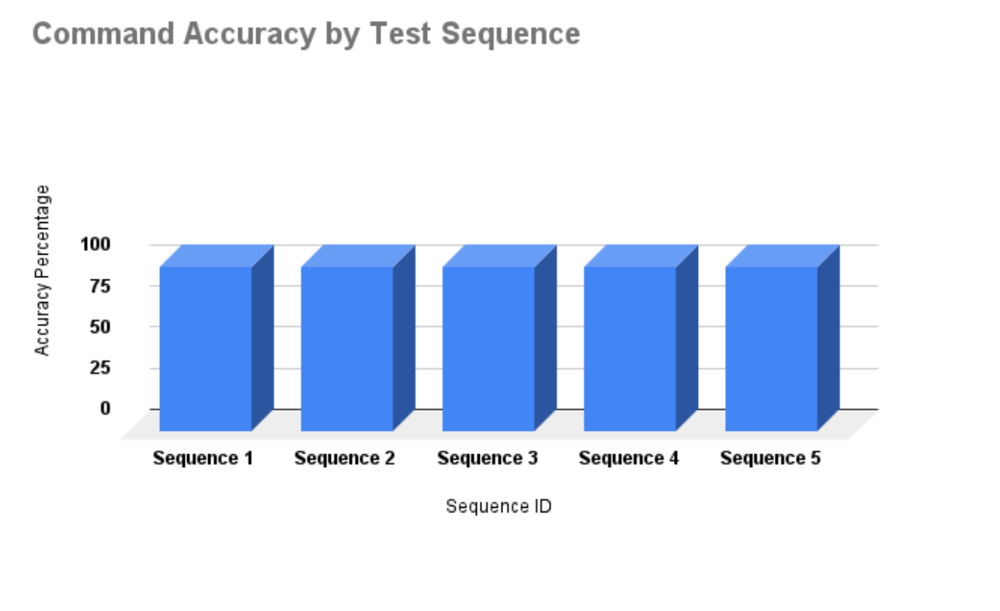
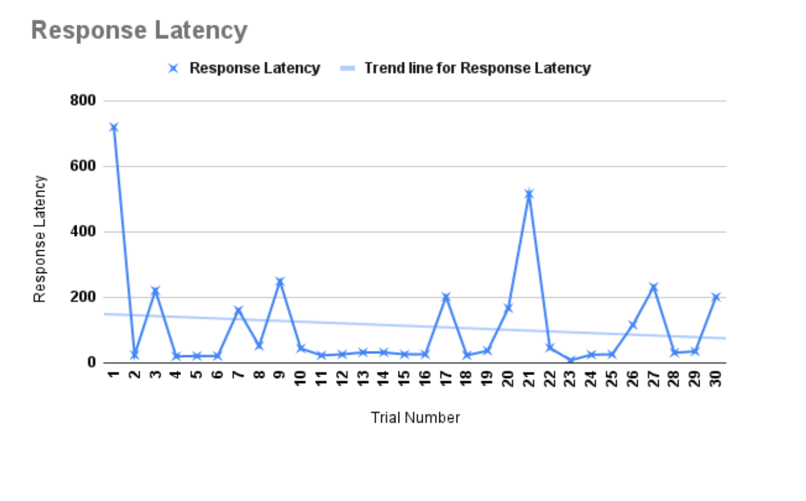
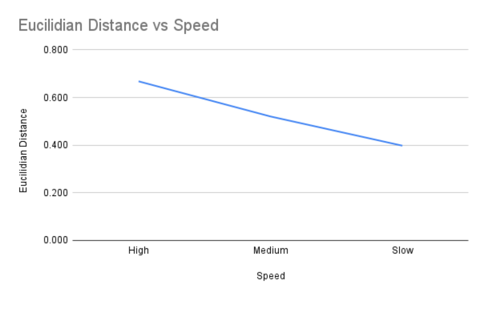

## Demo Video
▶️ [Watch the robotic arm demo](Project_Files/Video/robotcontrolapp_workingvideo.mp4)

# Robotic Arm Application: Voice-Controlled AR Interface

## Overview
This project presents a **voice-controlled robotic arm system** that integrates **Augmented Reality (AR)** with **robot programming** to enable intuitive, hands-free human–robot interaction. Using a **RealWear head-mounted display**, spoken commands are translated into robot actions via **ROS**, with visualization and feedback provided through a **Unity-based AR interface**.

The system is evaluated in a **Gazebo simulation** using a **Franka Emika robotic arm**, focusing on command accuracy, response latency, and end-effector precision. The work was developed as part of an **MSc in Robotics** dissertation.

---

## Key Objectives
- Enable **hands-free robot control** using natural voice commands  
- Reduce the **training barrier** for robot programming  
- Improve **safety and accessibility** in industrial and operational environments  
- Evaluate system performance using **quantitative metrics**

---

## System Architecture

The system integrates four primary components:

- **RealWear Headset**  
  Captures voice commands using built-in speech recognition APIs.

- **Unity (AR Interface)**  
  Displays command options, robot status, and visual feedback in an AR environment.

- **ROS (Robot Operating System)**  
  Acts as middleware, handling command translation, communication, and robot control.

- **Gazebo Simulation**  
  Simulates a Franka Emika robotic arm for safe testing and evaluation.

Communication between Unity and ROS is achieved using **ROSBridge (WebSocket)**, enabling real-time data exchange.

---

## Voice Command Pipeline

1. **Voice Input**  
   User issues a spoken command via the RealWear headset.

2. **Command Mapping**  
   Recognized phrases are mapped to predefined robot actions.

3. **ROS Topic Publishing**  
   Commands are published to ROS topics via ROSBridge.

4. **Motion Execution**  
   The robot controller executes the command using **MoveIt!** for motion planning.

---

## Robot Control & Motion Planning

- **MoveIt!** is used for trajectory generation and collision-aware motion planning  
- Supports both **joint-space** and **pose-based** goals  
- Ensures smooth, safe motion within the simulated workspace  
- Continuous control mode allows repeated command execution  

---

## Augmented Reality User Interface (Unity)

The Unity interface provides:
- A clear **command menu** for available voice commands  
- Real-time **visual feedback** of robot state  
- AR overlays to improve situational awareness  

The interface is designed to minimize cognitive load and support non-expert users.

---

## Evaluation Methodology

Performance evaluation was conducted in the Gazebo simulation environment using structured test protocols.

### Metrics
- **Command Accuracy**  
  Percentage of correctly recognized and executed voice commands.

- **Response Latency**  
  Time between issuing a voice command and the robot initiating movement.

- **Precision**  
  End-effector positional error relative to the target pose.

---

## Results & Data Analysis

The system was evaluated in a **Gazebo simulation environment** using structured and repeatable test protocols.
Performance was assessed across three key metrics: **command accuracy**, **response latency**, and **positional precision**.
All experiments were conducted under controlled simulated conditions using a Franka Emika robotic arm model.

---

### Command Accuracy

The voice-controlled robotic arm demonstrated **100% command execution accuracy** across all test sequences.

- **Test setup:**  
  - 5 independent test sequences  
  - Each sequence contained **12 distinct movement and stop commands**  
- **Total commands tested:** 60  
- **Successful executions:** 60 / 60  

This indicates a **robust and reliable voice-command interface**, capable of consistently translating spoken commands into correct robotic actions under simulated conditions.

*Figure: Command accuracy across multiple test sequences (100% success rate).*

---

### Response Latency

Response latency was defined as the **time elapsed between issuing a voice command and the robot arm initiating movement**.

- **Number of trials:** 30  
- **Average response latency:** **112.1 ms**  
- **Standard deviation:** **159.68 ms**

Latency variations are expected due to:
- Voice recognition processing  
- Network communication via ROSBridge (WebSocket)  
- ROS command handling and motion planning  

A downward trend in latency was observed over successive trials, suggesting **potential self-optimization effects**, such as improved network handling or caching mechanisms within the communication pipeline.

*Figure: Response latency measured across multiple trials.*

---

### Precision Analysis (Speed vs Accuracy)

Precision was evaluated by measuring the **Euclidean distance between a fixed target position**  
(X: 0.3, Y: 0.3, Z: 0) and the robot arm’s final end-effector position.

- **Total trials:** 15  
- **Speed categories:** High, Medium, Slow  

| Speed Setting | Average Error (m) | Standard Deviation (m) |
|--------------|------------------|------------------------|
| High         | 0.134            | 0.035                  |
| Medium       | 0.104            | 0.038                  |
| Slow         | 0.080            | 0.005                  |

The results reveal a **clear inverse relationship between movement speed and positional accuracy**.
As speed decreases, precision improves, highlighting an inherent **speed–accuracy trade-off** in robotic motion control.

*Figure: Euclidean distance to target versus movement speed.*

---

### Summary of Findings

- **Command Accuracy:** 100% across all test cases  
- **Average Response Latency:** 112.1 ms (real-time capable)  
- **Precision:** Highest accuracy achieved at lower movement speeds  

These results demonstrate that the system is **responsive, accurate, and well-suited for hands-free robotic control**, particularly in scenarios where reliability and safety are critical.

---

## Challenges & Solutions

| Challenge | Solution |
|--------|--------|
| Voice recognition errors in noisy conditions | Improved command parsing and constrained vocabulary |
| Latency between Unity and ROS | Optimized ROSBridge communication pipeline |
| Real-time AR feedback | Optimized Unity rendering and update loops |

---

## Limitations
- Evaluated in **simulation only** (Gazebo)  
- Performance dependent on headset speech recognition quality  
- AR visualization limited by headset hardware constraints  

---

## Future Work
- Deploy and validate on a **physical robotic arm**  
- Expand voice command vocabulary for complex tasks  
- Improve robustness in noisy industrial environments  
- Integrate additional AR guidance (task previews, safety zones)

---

## Technologies Used
- **ROS (Robot Operating System)**  
- **MoveIt!** (motion planning)  
- **Unity** (Augmented Reality interface)  
- **Gazebo** (robot simulation)  
- **ROSBridge / WebSocket**  
- **RealWear Head-Mounted Display**  

---

## Academic Context
This project was developed as part of an MSc dissertation titled  
**“AR with Robot Programming”**.

---

## Contact
**Pranjal Samant**  
Graduate Engineer (Robotics)

- GitHub: https://github.com/pranjalsamant1  
- LinkedIn: https://www.linkedin.com/in/pranjalsamant  

