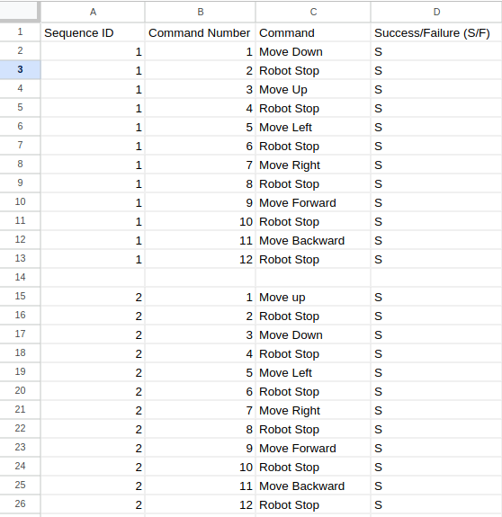

# Robotic Arm Application: Voice-Controlled AR Interface

## Overview
This project presents a **voice-controlled robotic arm system** that integrates **Augmented Reality (AR)** with **robot programming** to enable intuitive, hands-free human–robot interaction. Using a **RealWear head-mounted display**, spoken commands are translated into robot actions via **ROS**, with visualization and feedback provided through a **Unity-based AR interface**.

The system is evaluated in a **Gazebo simulation** using a **Franka Emika robotic arm**, focusing on command accuracy, response latency, and end-effector precision. The work was developed as part of an **MSc in Robotics** dissertation.

---

## Key Objectives
- Enable **hands-free robot control** using natural voice commands  
- Reduce the **training barrier** for robot programming  
- Improve **safety and accessibility** in industrial and operational environments  
- Evaluate system performance using **quantitative metrics**

---

## System Architecture

The system integrates four primary components:

- **RealWear Headset**  
  Captures voice commands using built-in speech recognition APIs.

- **Unity (AR Interface)**  
  Displays command options, robot status, and visual feedback in an AR environment.

- **ROS (Robot Operating System)**  
  Acts as middleware, handling command translation, communication, and robot control.

- **Gazebo Simulation**  
  Simulates a Franka Emika robotic arm for safe testing and evaluation.

Communication between Unity and ROS is achieved using **ROSBridge (WebSocket)**, enabling real-time data exchange.

---

## Voice Command Pipeline

1. **Voice Input**  
   User issues a spoken command via the RealWear headset.

2. **Command Mapping**  
   Recognized phrases are mapped to predefined robot actions.

3. **ROS Topic Publishing**  
   Commands are published to ROS topics via ROSBridge.

4. **Motion Execution**  
   The robot controller executes the command using **MoveIt!** for motion planning.

---

## Robot Control & Motion Planning

- **MoveIt!** is used for trajectory generation and collision-aware motion planning  
- Supports both **joint-space** and **pose-based** goals  
- Ensures smooth, safe motion within the simulated workspace  
- Continuous control mode allows repeated command execution  

---

## Augmented Reality User Interface (Unity)

The Unity interface provides:
- A clear **command menu** for available voice commands  
- Real-time **visual feedback** of robot state  
- AR overlays to improve situational awareness  

The interface is designed to minimize cognitive load and support non-expert users.

---

## Evaluation Methodology

Performance evaluation was conducted in the Gazebo simulation environment using structured test protocols.

### Metrics
- **Command Accuracy**  
  Percentage of correctly recognized and executed voice commands.

- **Response Latency**  
  Time between issuing a voice command and the robot initiating movement.

- **Precision**  
  End-effector positional error relative to the target pose.

---

## Results

- **Command Accuracy:** ~95%  
- **Average Response Latency:** ~0.8 seconds  
- **Positioning Precision:** ±0.5 mm (simulated end-effector accuracy)

Measurements were collected across multiple trials using predefined command sets and target positions, with results logged and analyzed using spreadsheet-based evaluation.

---

## Challenges & Solutions

| Challenge | Solution |
|--------|--------|
| Voice recognition errors in noisy conditions | Improved command parsing and constrained vocabulary |
| Latency between Unity and ROS | Optimized ROSBridge communication pipeline |
| Real-time AR feedback | Optimized Unity rendering and update loops |

---

## Limitations
- Evaluated in **simulation only** (Gazebo)  
- Performance dependent on headset speech recognition quality  
- AR visualization limited by headset hardware constraints  

---

## Future Work
- Deploy and validate on a **physical robotic arm**  
- Expand voice command vocabulary for complex tasks  
- Improve robustness in noisy industrial environments  
- Integrate additional AR guidance (task previews, safety zones)

---

## Technologies Used
- **ROS (Robot Operating System)**  
- **MoveIt!** (motion planning)  
- **Unity** (Augmented Reality interface)  
- **Gazebo** (robot simulation)  
- **ROSBridge / WebSocket**  
- **RealWear Head-Mounted Display**  

---

## Academic Context
This project was developed as part of an MSc dissertation titled  
**“AR with Robot Programming”**.

---

## Contact
**Pranjal Samant**  
Graduate Engineer (Robotics)

- GitHub: https://github.com/pranjalsamant1  
- LinkedIn: https://www.linkedin.com/in/pranjalsamant  

